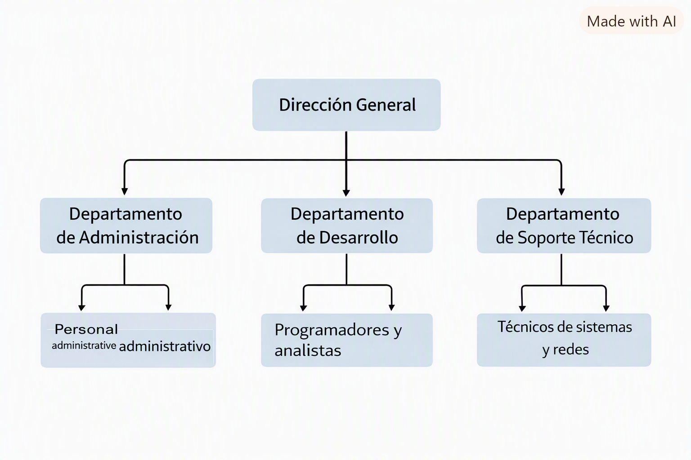

### **Marco de referencia de la empresa ficticia: TechMarbella Solutions S.L.**
**1. Tipo de organización**
TechMarbella Solutions S.L. es una pequeña y mediana empresa (PYME) del sector tecnológico.
Su estructura y funcionamiento se alinean con las características de una organización privada, orientada a servicios, con un enfoque en soluciones informáticas y soporte técnico para clientes locales y regionales.

Características clave:

Empresa privada con ánimo de lucro.

Sector: Tecnologías de la información (TI).

Tamaño: 30 empleados.

Actividad basada en servicios profesionales y soporte técnico.

**2. Actividad específica**
La empresa se dedica a:

Servicios de soporte técnico a empresas.

Desarrollo y mantenimiento de soluciones informáticas.

Gestión de redes y sistemas corporativos.

Consultoría tecnológica para PYMEs.

Implementación de infraestructura TI (servidores, redes, seguridad).

Su actividad principal es garantizar que los clientes dispongan de sistemas informáticos seguros, estables y eficientes.

**3. Historia**
TechMarbella Solutions S.L. fue fundada en 2016 por dos técnicos informáticos con experiencia en administración de sistemas y soporte empresarial.
Inicialmente comenzó como un pequeño servicio de asistencia técnica local, pero con el aumento de la demanda de soluciones tecnológicas en la Costa del Sol, la empresa creció hasta convertirse en un proveedor integral de servicios TI.

Hitos relevantes:

2016: Fundación y primeros clientes locales.

2018: Expansión a servicios de redes y servidores.

2020: Creación del departamento de desarrollo.

2023: Implementación de soluciones de seguridad avanzada (IDS/IPS, monitorización).

2025: Consolidación como proveedor tecnológico para empresas medianas.

**4. Estructura jerárquica**
La empresa adopta una estructura jerárquica funcional, donde cada departamento tiene responsabilidades específicas y reporta a la dirección general.

Niveles jerárquicos:

Dirección General

Responsables de departamento

Administración

Desarrollo

Soporte Técnico

Técnicos y personal operativo

**5. Organigrama**
Representación textual del organigrama:

                     

   
**6. Espacio físico**
La empresa cuenta con una oficina situada en Marbella, distribuida en:

Recepción y zona administrativa

Sala de servidores / CPD pequeño

Área de soporte técnico

Sala de desarrollo

Sala de reuniones

Zona de descanso para empleados

El espacio está diseñado para facilitar la comunicación entre departamentos y permitir un entorno de trabajo colaborativo.

**7. Comunicación**
La comunicación interna se realiza mediante:

Reuniones semanales de coordinación.

Plataforma interna de mensajería (Teams/Slack).

Intranet corporativa para documentación y procedimientos.

Correos electrónicos para comunicaciones formales.

La comunicación externa se gestiona a través de:

Teléfono corporativo.

Correo electrónico.

Portal de clientes para incidencias.

**8. Transmisión de la información**
La empresa utiliza mecanismos formales y estructurados para transmitir información:

Intranet corporativa con documentación, manuales y procedimientos.

Sistema de tickets para incidencias y solicitudes.

Directorios compartidos con permisos por departamento.

Políticas de acceso basadas en roles (RBAC).

Copias de seguridad para garantizar la integridad de la información.

La información sensible se transmite cifrada y con autenticación reforzada.

**9. Relaciones**
Relaciones internas:

Colaboración entre departamentos para proyectos y soporte.

Coordinación directa entre responsables y dirección.

Flujo de trabajo basado en procedimientos y roles definidos.

Relaciones externas:

Proveedores de hardware y software.

Empresas clientes que contratan servicios TI.

Servicios de telecomunicaciones y hosting.

**10. Economía (manejo del dinero)**
La empresa se financia mediante:

Contratos de mantenimiento TI.

Servicios de soporte técnico.

Proyectos de infraestructura y seguridad.

Consultoría tecnológica.

Gestión económica:

Presupuestos anuales por departamento.

Control de gastos en equipamiento y licencias.

Facturación mensual a clientes.

Inversiones en infraestructura y formación del personal.
